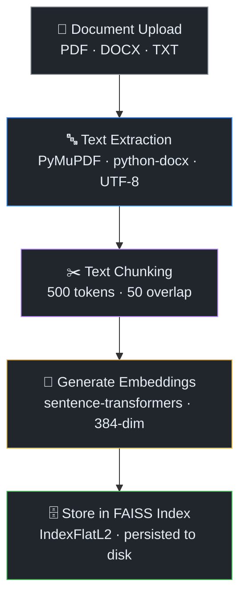

<div align="center">


<p><em>AI-Powered Document Q&A System using RAG</em></p>

</div>

<p>
  
  
  
  
  
</p>

</div>

---

## 📌 Overview

<div align="center">

> **DocuMindAI** is an advanced AI-powered application that enables users to **interact with unstructured documents using natural language**.
>
> Built on **Retrieval-Augmented Generation (RAG)**, the system converts raw text into a **semantic knowledge base**, allowing users to ask questions and receive **context-aware, accurate responses**.
>
> It bridges the gap between **unstructured data and intelligent decision-making**, simulating real-world AI-powered document intelligence systems.

</div>

---

## 🚀 Features

<table>
<tr>
<td width="50%">

### 💬 Natural Language Interaction


- Chat directly with your documents
- Human-like conversational experience
- Simplifies complex information retrieval

</td>
<td width="50%">

### 🧠 Context-Aware Intelligence


- Uses RAG for accurate responses
- Reduces hallucinations significantly
- Maintains contextual relevance

</td>
</tr>
<tr>
<td width="50%">

### 🔍 Semantic Search Engine


- Embedding-based similarity search
- Finds meaning, not just keywords
- Efficient knowledge retrieval

</td>
<td width="50%">

### ⚡ High-Performance Retrieval


- FAISS-powered vector search
- Fast and scalable retrieval
- Handles large documents efficiently

</td>
</tr>
</table>

---

## 🧠 How It Works

 🧠 How It Works — Document Ingestion Pipeline

## Option A — SVG (recommended, paste into README)

```html
<p align="center">
  
</p>
```

---

## Option B — Mermaid (native GitHub rendering, paste into README)




## 🛠️ Tech Stack

| Layer | Technology | Purpose |
|-------|-----------|---------|
| 🐍 **Language** | Python 3.9+ | Core runtime |
| 🔗 **Framework** | LangChain | RAG orchestration |
| 🤖 **LLM** | OpenAI / HuggingFace | Language generation |
| 🧮 **Embeddings** | Sentence Transformers | Vector representations |
| ⚡ **Vector DB** | FAISS | Similarity search |
| 📊 **UI** | Streamlit | Interactive frontend |
| 📄 **Parsers** | PyPDF2, python-docx | Document ingestion |

---

## 📁 Project Structure

```
DocuMindAI/
├── 📄 app.py                 # Streamlit entrypoint
├── 🔧 config.py              # Configuration & API keys
├── 📁 src/
│   ├── 🔤 ingestion.py       # Document loading & chunking
│   ├── 🧮 embeddings.py      # Embedding generation
│   ├── 🗄️ vectorstore.py     # FAISS index management
│   ├── 🔍 retriever.py       # Semantic search logic
│   └── 🤖 rag_chain.py       # LLM + RAG pipeline
├── 📁 data/                  # Uploaded documents
├── 📁 vectorstore/           # Persisted FAISS index
├── 📄 requirements.txt
└── 📄 README.md
```

---

## ⚙️ Installation

```bash
# 1. Clone the repository
git clone https://github.com/yourusername/DocuMindAI.git
cd DocuMindAI

# 2. Create virtual environment
python -m venv venv
source venv/bin/activate        # Linux / macOS
# venv\Scripts\activate         # Windows

# 3. Install dependencies
pip install -r requirements.txt

# 4. Set up environment variables
cp .env.example .env
# Add your OPENAI_API_KEY inside .env

# 5. Run the app
streamlit run app.py
```

---

## 🔐 Environment Variables

```env
OPENAI_API_KEY=your_openai_api_key_here
HUGGINGFACE_API_TOKEN=your_hf_token_here     # optional
EMBEDDING_MODEL=sentence-transformers/all-MiniLM-L6-v2
CHUNK_SIZE=500
CHUNK_OVERLAP=50
TOP_K_RESULTS=5
```

---

## 🎯 Usage

1. **Launch** the Streamlit app via `streamlit run app.py`
2. **Upload** a PDF, DOCX, or TXT document using the sidebar
3. **Wait** for the document to be processed and indexed
4. **Ask** any question in natural language in the chat input
5. **Get** context-aware answers grounded in your document

---

## 🗺️ Roadmap

- [x] PDF & DOCX ingestion
- [x] FAISS vector store integration
- [x] RAG pipeline with LangChain
- [x] Streamlit chat interface
- [ ] Multi-document support
- [ ] Chat history & memory
- [ ] Source citation with page numbers
- [ ] REST API endpoint
- [ ] Docker deployment

---

## 🤝 Contributing

Contributions are welcome! Please open an issue or submit a pull request.

```bash
# Fork → Clone → Create branch → Commit → Push → PR
git checkout -b feature/your-feature-name
git commit -m "feat: add your feature"
git push origin feature/your-feature-name
```

---

## 📄 License

This project is licensed under the **MIT License** — see the [LICENSE](LICENSE) file for details.

---

<div align="center">

**Built with ❤️ using RAG, FAISS, LangChain & Streamlit**

⭐ Star this repo if you found it helpful!

</div>
